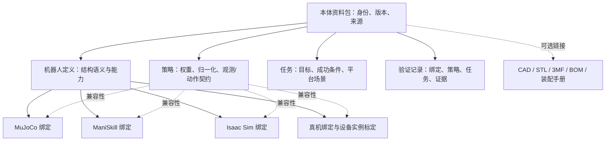

# M2f 本体资料包与跨平台机器人接入设计

日期：2026-10-01。状态：M2f.1 已实现基础元数据；M2f.2a 资产安装和机械臂基础控制已实现；抓取、第二平台与 M2f.3 待实现。

## 问题与目标

现有 catalog.json 是 MuJoCo MJCF 路径登记表，不能表达同一机器人在不同仿真平台、策略与真机间的关系。具身主线需要保留本体资料包作为机器人根节点，以支持仿真实验、复现与真机迁移。制造资料非运行必需，当前仅保留可选链接。

## 迭代归属

本次为 M2f，而非 M2e：原 README 已将 M2e 留给网页 Chat。里程碑编号与 crate SemVer 独立。

- M2f.1：平台无关本体资料包、严格解析/关系校验、CLI 查询、四款机器人计划条目。本次范围。
- M2f.2：可复现下载安装、固定上游版本/校验、Franka 与 SO101 控制适配、抓取场景、Episode 版本追溯；用第二仿真平台验证同一任务。
- M2f.3：Go2 与 Microduck 持续低层控制、策略推理、速度/姿态契约、停止与跌倒反馈。

M2f.1 的计划条目不构成模型已安装、驱动已实现或任务已验证的承诺。真正的物理限位、安全执行和依赖检查在后续绑定实现中完成。

## 关系

共享机器人身份和关节语义；平台控制器、传感器、碰撞/物理配置各自适配。型号与设备实例分离，设备实例关联标定和停止行为。完整结构参数会在实际机器人接入时扩展 schema，当前允许未研究条目保留空能力和未知坐标约定，不猜测参数。

## 数据与代码位置

- robots/catalog.json：schema v1，四款机器人资料包。未来可拆分单机器人文件，保留根索引。
- robo-archon-embodied::body：平台无关类型、加载、校验与策略契约匹配，不依赖 MuJoCo/Python。
- CLI：--list-robots / --inspect-robot / --body-catalog。
- python/assets/catalog.json 与 --model / --list-models：保留现有行为；本体目录查询不启动后端、不下载文件。

M2f.1 使用 BTreeMap 表示扩展平台，而不限定平台枚举。控制/观测契约用带版本的标识，契约应约定顺序、单位、坐标、归一化、时间与频率；目前只有精确匹配，不自动推断或转换。

## 成熟度与信任边界

planned：未完成接入。preview：绑定可预览。controlled：已具备控制器与契约。task_verified：存在关联任务验证证据。文件存在与成熟度分开；状态来自维护者登记，并非本机可用性检查或证据真实性认证。

资料包是数据，不能执行代码、授权动作或绕过 SafetyGate。CLI 不将第三方元数据直接作为命令运行。后续安装要求固定上游 commit、保留许可证、隔离缓存、完整性检查；Microduck 代码、模型、权重许可证分别记录，不默认继承顶层许可证。

## 平台边界

MuJoCo 原生 MJCF，也能导入 URDF；ManiSkill 导入 URDF/MJCF 但控制器和传感器需要另配；Isaac Sim 使用 USD，提供 URDF/MJCF 导入。导入不保证物理或策略等价。

后续 RobotBackend 增加能力查询和动作协商，Runtime 管理任务生命周期，低层控制与仿真步进留给绑定。机械臂使用轨迹/末端/夹爪目标；腿足使用持续速度/姿态控制，停止与急停分开定义。真机部署必须实测校准与验证，不能仅凭元数据兼容自动放行。

## 来源

- https://github.com/google-deepmind/mujoco_menagerie
- https://github.com/TheRobotStudio/SO-ARM100/tree/main/Simulation/SO101
- https://github.com/pollen-robotics/microduck_rl
- https://maniskill.readthedocs.io/en/latest/user_guide/tutorials/custom_robots.html
- https://docs.isaacsim.omniverse.nvidia.com/latest/importer_exporter/importers_exporters.html

## M2f.2a 进展

固定上游资产安装、内容指纹、显式控制 profile、CLI install/doctor/robot 已实现。Franka/SO101 MuJoCo binding 为 controlled，其他绑定保持 planned。详见 [spec](specs/m2f-2-arm-bindings.md)。
