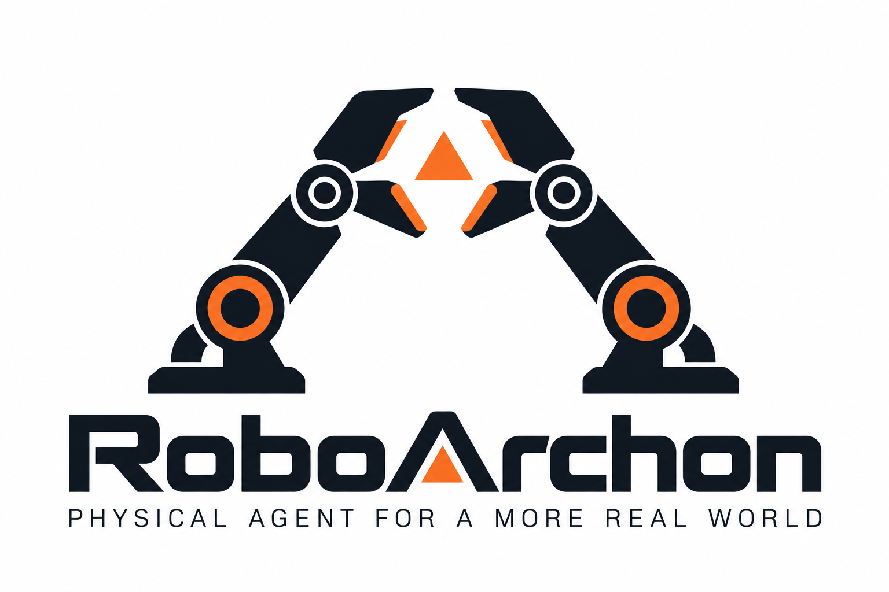

# RoboArchon 品牌标志

  

此图是项目维护者选定的正式品牌 Logo。左右机械臂构成 A 形拱门，橙色三角核心表达 Agent 的协调与决策；品牌口号为 **Physical Agent for a More Real World**。

仓库首页和文档首页使用同一份 [PNG 原图](roboarchon-logo.png)，保留用户提供的图像，不重新生成。原图包含白色背景，深色页面也按完整白底品牌图展示。

## 终端标志

TUI 使用 Unicode Braille 点阵字符（如 `⣿`、`⠿`），每个字符容纳 2 × 4 个点。机械臂图案与下方 RoboArchon 字标都从原图取样，橙色强调核心、关节和字标内的三角，口号居中置于下方。

推荐入口：`cargo run -p robo-archon-cli -- --tui`。

| 终端尺寸 | 标志 |
| --- | --- |
| 至少 88 列、44 行 | 64 列 × 17 行点阵，加空行与口号，共 19 行 |
| 至少 64 列、34 行 | 48 列 × 13 行点阵，加空行与口号，共 15 行 |
| 更小的窗口 | `▲ RoboArchon` 紧凑标识，优先保留操作空间 |

标志居中显示，建议深色背景、等宽字体和至少 110 列 × 44 行的窗口。字体需要支持 Unicode Braille 或启用字体回退；点的形状与密度会随字体变化。旧版显式模型 TUI 在顶部可用空间中展示标志。

轮廓取自 PNG 的像素矩形 `100,150–1440,860`（包含图案与字标，不包含原图口号）。使用面积重采样，再区分背景、机械臂、橙色强调；两份静态矩阵编译进程序，运行时无需图片解析库。共享渲染实现位于 `crates/robo-archon-cli/src/brand.rs`，矩阵位于相邻的 `brand-compact.txt` 和 `brand-large.txt`。

终端标志是适配版本，对外文档继续使用 PNG 原图。
