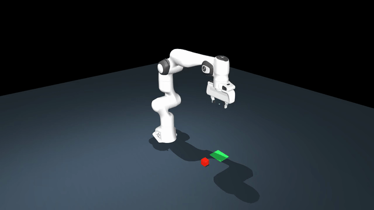
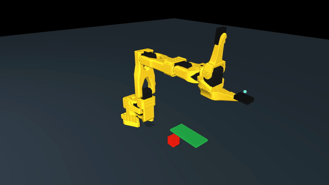

# 机器人 Gallery：真实物理抓放

Franka Panda 和 SO101 在 MuJoCo 中支持归位、基础关节动作、夹爪开合及 IK 抓放。Franka 同时支持 ManiSkill/SAPIEN 的同一抓放任务。Go2、Microduck 的运动控制属于下一阶段 M2f.3。

| Franka Panda / MuJoCo | SO101 / MuJoCo |
| --- | --- |
|  |  |
| [高清 MP4](media/franka-panda-pick-place.mp4) | [高清 MP4](media/so101-pick-place.mp4) |

视频中方块由真实接触和摩擦带动，没有焊接或瞬移。两平台各运行三种初始位置，使用双指接触、抬升、位置、释放和速度共同判定成功；见 [验收报告](validation/m2f-2-report.json)。SO101 场景使用适配的指尖碰撞 pads；未做真机或任意障碍环境验证。

## 安装 MuJoCo 与固定机器人资产

在仓库根目录执行：

```bash
python3 -m venv .venv-mujoco
.venv-mujoco/bin/pip install -r python/requirements-mujoco-tested.txt
export ROBO_ARCHON_PYTHON="$PWD/.venv-mujoco/bin/python"
cargo build --locked -p robo-archon-cli

./target/debug/robo-archon --install-robot franka_panda
./target/debug/robo-archon --install-robot so101
./target/debug/robo-archon --doctor-robot franka_panda
./target/debug/robo-archon --doctor-robot so101
```

模型源版本固定在 `robots/assets.lock.json`。安装器保留 LICENSE、不执行上游脚本、不覆盖未知或被修改的目录。下载 mesh 不提交本仓库；制造文件只保留可选链接。

## 抓放演示

```bash
# 无窗口 CPU；seed 0/1/2 为三种物体初始位置
./target/debug/robo-archon --robot franka_panda --backend mujoco \
  --demo pick-place --seed 1 --save-frames false
./target/debug/robo-archon --robot so101 --backend mujoco \
  --demo pick-place --seed 1 --save-frames false

# 离屏录制，需要可用 OpenGL 和 ffmpeg
./target/debug/robo-archon --robot franka_panda --backend mujoco \
  --demo pick-place --seed 1 --record-video demo.mp4

# macOS 交互窗口用 mjpython 启动 worker
export ROBO_ARCHON_PYTHON="$PWD/.venv-mujoco/bin/mjpython"
./target/debug/robo-archon --robot so101 --backend mujoco \
  --demo pick-place --seed 1 --viewer --save-frames false
```

控制固定 50Hz。打印 `success=true` 才表示物理任务完成；命令发完、物体未抓住或未放稳会保存失败并非零退出。Episode 默认保存到 `~/.robo-archon/episodes/ep-*/episode.json`，用 `--episode-dir` 修改。`--stdin-stop` 可输入 stop/estop 中断，或使用 `--auto-stop-ms` 验证停止。

## 切换到 ManiSkill

使用独立 Python 3.11 环境。Franka 的同一个 CLI 任务切换为 SAPIEN 的真实物理执行；上层任务与成功条件保持一致。

```bash
python3.11 -m venv .venv-maniskill
# Linux CPU 先执行；macOS 跳过这一行
.venv-maniskill/bin/pip install torch==2.8.0 --index-url https://download.pytorch.org/whl/cpu
.venv-maniskill/bin/pip install -r python/requirements-maniskill-tested.txt
export ROBO_ARCHON_PYTHON="$PWD/.venv-maniskill/bin/python"

./target/debug/robo-archon --robot franka_panda --backend maniskill \
  --demo pick-place --seed 1 --save-frames false
```

ManiSkill 从固定包加载 URDF/mesh，连接时检查 runtime 版本、内容指纹和 TCP 对齐。共享 MJCF 用于 IK/保守几何参考，物体运动和接触测量使用 SAPIEN。macOS 本次验证 CPU headless 模式；该平台图像输出需要 Vulkan，未宣称 macOS 图形兼容。ManiSkill 当前仅开放 Franka 抓放；SO101/ManiSkill 和 Isaac Sim 仍为 planned。

## 基础动作与 TUI

```bash
export ROBO_ARCHON_PYTHON="$PWD/.venv-mujoco/bin/python"
./target/debug/robo-archon --robot franka_panda --backend mujoco \
  --policy instruction --instruction "挥手然后关闭夹爪" --save-frames false
./target/debug/robo-archon --robot so101 --backend mujoco \
  --policy instruction --tui --save-frames false
```

支持 home/归位、wave/挥手、demo、夹爪开合及顺序组合。wave 是有限幅基座关节摆动；不是任意末端规划。TUI `/estop` 停止、`/quit` 退出。抓放为独立多阶段 `--demo pick-place`，不接入 LLM/TUI。

Franka 使用 7 臂关节+夹爪，SO101 使用 new calibration 的 5 臂关节+夹爪。关节单位 rad、夹爪 [0,1] 是本绑定规范，不能直接当真机 LeRobot 标定值。

## 重复验证

```bash
cargo test --workspace --locked
python3 -m unittest discover -s scripts/tests -p test_robot_assets.py
.venv-mujoco/bin/python -m unittest discover -s scripts/tests -p test_arm_bindings.py
.venv-mujoco/bin/python -m unittest discover -s scripts/tests -p test_pick_place.py
ROBO_ARCHON_TEST_MANISKILL=1 .venv-maniskill/bin/python \
  -m unittest discover -s scripts/tests -p test_pick_place.py
```

`--list-robots` 显示目录成熟度；`--list-models` 查看文件存在状态；`--doctor-robot` 检查 MuJoCo 来源、内容和控制映射。详见 [M2f.2 spec](specs/m2f-2-arm-bindings.md)。GitHub CI 重复运行测试矩阵并导出视频/Episode artifacts。
