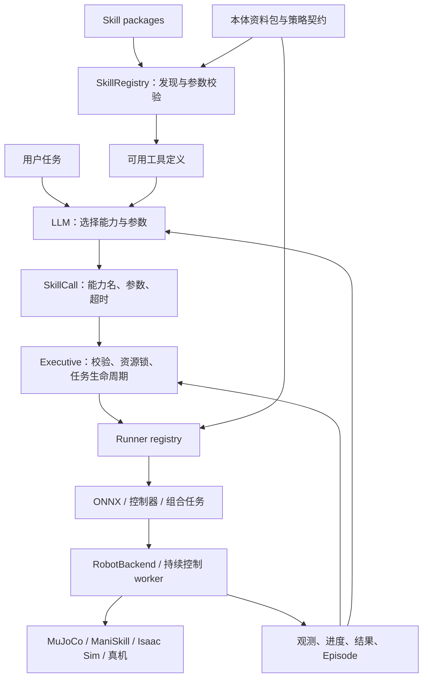

# AgentOS 可扩展技能设计

状态：M2g.4 Microduck 组合、持续聊天与官方动作接入已实现，验收见 [M2g.4 spec](specs/m2g-4-microduck-composition.md)。M2g.1 已完成；M2g.2 已完成可信 Runner 注册、Executive 生命周期与 Microduck 持续控制及限定预设试玩验收。M2g.3 已实现兼容 ONNX 包与动态 LLM 工具调用，并以官方权重副本及本地模拟 API 验收；真实自训练行为与云端模型推理未验收。执行验收见 [M2g.2 spec](specs/m2g-2-continuous-skills.md)。

AgentOS 的扩展入口是可注册的技能包。官方策略、自训练策略、传统控制器和任务组合使用同一套能力描述，不把机器人名称、技能名单或 ONNX 文件写死在 LLM 提示词中。Microduck 是首个持续策略执行案例，不是技能系统的特殊核心。

## 四个独立角色

| 概念 | 职责 | 不承担的职责 |
| --- | --- | --- |
| 本体资料包 | 机器人身份、平台绑定、观测/动作契约、策略与来源 | 不执行 Skill，不授予执行权 |
| Policy artifact | 权重、模型版本、归一化、关节顺序、推理频率 | 不决定任务、不直接成为 LLM 工具 |
| Skill package | 可调用能力、参数、前置条件、成功语义和目标绑定 | 不持有机器人控制循环 |
| Runner | 将 Skill 调用转为策略执行、控制器调用或组合任务 | 不绕过 Executive 和资源仲裁 |

一条策略可以支持多个 Skill，例如同一行走策略提供前进、转弯、站立。一个 Skill 可以组合多条策略，例如迎宾包含行走、停车、鞠躬。纯软件 Skill 可以通过未来的数字平面适配复用同样的描述思路；当前实现覆盖具身技能注册与 Microduck 持续执行，不重新启用冻结的数字 workspace。

图表示可扩展设计；当前已实现动态 LLM 工具目录 → Registry → Executive → Runner → worker，以及同一仿真会话的有序组合。其他仿真器、真机和第二机器人仍需各自的适配与行为验收。

## 技能包与注册

包形如 `skills/<package>/skill.json`，可附带 README、验证报告、权重来源/锁定文件。`--skills-dir` 可指向用户自己的目录。当前加载器扫描一级包目录，读取 `skill.json`；它不下载文件、不导入 Python、不执行安装脚本。新增符合格式的文件后重新加载/启动即可发现，尚不提供运行时热更新命令；会话启动时固定目录与已校验策略，避免执行期间契约变化。

稳定的 `id` 用于任务和日志；`version` 用于追溯；独立 `tool_name` 使用常见 API 可接受的字母、数字、下划线或连字符，避免点号 ID 直接成为供应商工具名称。ID 或工具名重复均报错，不静默覆盖。当前 version 是非空字符串，不做 SemVer 协商。

参数采用有意受限的声明：有界 number、有界 integer、boolean 和有限 choices 的 string。注册时校验上下界和默认值；调用时拒绝未知参数、类型不符、越界和缺失值，补齐声明的默认值，不做字符串转数字或静默截断。Registry 从同一份定义生成 provider-neutral JSON Schema，避免 LLM 提示词与运行时参数要求分离。暂不支持任意 JSON Schema、数组、嵌套对象或动态表达式。

每个 Skill 可声明多个 `(body, backend)` 绑定。绑定引用 runner ID 和本体包中的 policy ID，携带不可由 LLM 覆盖的 adapter config。例：同一逻辑能力可以由 MuJoCo ONNX runner 或其他平台原生控制器执行，用户调用参数保持一致。增加新平台需要真实适配、验证，不假设跨仿真器策略直接等价。

本体包负责“机器人有哪些策略及其契约”，技能包负责“哪项用户能力调用哪些策略”；只引用策略 ID，不重复存一套权重/关节契约。M2g.1 使用已有本体包契约匹配逻辑，但不会确认模型或权重在本机存在。

## 执行扩展点

已实现 `SkillRunner` 接口和 RunnerRegistry，按版本化 ID 注册可信执行适配器。当前 `onnx_policy.v1` 可执行 Microduck 官方 velstand、安装的同契约 ONNX 包和经固定权重校验的官方行为适配；`sequence.v1` 固定组合已接入；机械臂原语统一 Runner 仍是后续扩展：

- `profile_primitive.v1`：适配已有机械臂原语和 Executive 路径。
- `onnx_policy.v1`：加载已校验权重，并调用对应 observation/action adapter；策略推理和物理步进留在 worker。
- `sequence.v1`：固定步骤的可注册组合，递归展开后由同一个 Executive 与 worker 执行；另有供 LLM 生成受限有序任务的 `archon_sequence` 工具。

增加兼容的自训练 ONNX 技能只增加技能包、策略资料和绑定配置；不改 Archon 核心。改变观测结构、动作空间或控制方式则需要新增 adapter。真正新增 Runner 可先通过明确注册的 Rust 实现或专用进程协议接入，不承诺动态 Rust ABI、任意 pip 包或第三方 shell 文件可直接执行。

LLM 看的是 Skill 描述与参数，不是权重文件或关节数组。现有具身 `Policy::propose` 是高层提案接口，与 50 Hz 的神经网络运动策略不是同一执行层；后者由 Runner/worker 承载。旧机械臂动作仍走原路径，逐步适配，不强行把持续腿足控制变成离散 waypoint。

## 生命周期、停止与验证

Executive 保持单机器人唯一执行权。生命周期拟为 `queued → validating → running → stopping → succeeded/failed/cancelled/timed_out`；运行中可输出进度和观测。调用包含 `timeout_ms`，必须在 Skill 声明预算内。退出不等于任务成功，成功由适配器对实际观测判定并返回证据。

资源名按机器人实例限定。`whole_body` 必须与 base、legs、head 等子资源互斥，而不只是比较字符串；组合父任务持有资源，子技能共享同一个执行上下文，避免父子死锁。当前使用每机器人 Executive 的既有锁：`whole_body` 保守占用 Base、Arm、Gripper，未知资源拒绝执行。这能阻止与现有轨迹冲突；组合父任务已持有 whole-body 锁，子调用共享上下文且不会重新获取或释放父锁；通用资源树与多实例管理仍属于后续扩展。

Runtime 负责取消、优先级、外部超时和日志；worker 必须独立维护命令 lease/watchdog，让宿主进程退出、连接断开或 LLM 卡住时仍会停止接受运动指令。Runner 的 `stop`/急停由运行时触发，不能仅靠取消一个 Rust future。正常停止、急停、跌倒处理、恢复策略分别定义；跌倒后禁止直接重新发步行指令，reset 标记为仿真重启。

Manifest 的 `entry_conditions` 和 `success_description` 目前是说明数据，不执行字符串表达式。后续 Runner 提供确定性的状态检查与任务判定；不能把“standing”这个字写进 JSON 就宣称已经检查站立。最终目录应区分契约就绪与行为验收。M2g.3 当前只向 LLM 暴露绑定兼容、Runner 已注册、依赖与参数契约就绪的工具；这不证明自训练行为或自然语言目标已通过验收，执行结果保留实测证据。M2g.1 的 `compatible_definitions` 仅做本体与平台元数据过滤，不是可执行工具列表。

ONNX 的接入至少校验：权重哈希、模型和本体版本、输入/输出大小与语义、关节顺序、单位、坐标、归一化、控制频率、支持命令范围，以及进入/退出姿态。尺寸相同不代表语义兼容。默认不执行权重包附带的代码。权重和网格独立缓存，Git 保留配置与来源；演示仅提交小 GIF。

## 用户自训练策略流程

例如训练 `my_bow.onnx`：

1. 导出权重和训练时的契约、模型版本、命令接口、进入姿态、归一化与运行频率，固定来源版本和校验。
2. 安装带有版本、来源、SHA-256 与契约的自定义策略包；运行时会叠加 PolicyProfile，不必编辑仓库的本体目录，并单独建立行为验证记录。
3. 增加 `my.duck.bow` 技能包，声明工具描述、确实经过训练的参数、超时、资源、runner 与 policy 引用。
4. Runner 验证依赖与适配，先仿真验收动作和策略切换，记录失败、超时与停止结果。
5. 验证通过后进入可用工具目录，LLM 才能调用。若训练没有幅度输入，就不添加“幅度”参数。

上述自训练权重全流程属于 M2g.3。当前可安装同契约的自定义 ONNX 包，注册引用它的新 Skill，并通过动态 LLM 工具目录调用；不同观测或动作语义需要新增 adapter。机制验收使用官方权重副本，真实自训练行为待用户提供模型。见 [M2g.3 spec](specs/m2g-3-policy-packages-and-llm.md)。

## 迭代顺序

| 迭代 | 范围与交付 | 完成判据 |
| --- | --- | --- |
| M2g.1 | 独立 Skills crate、schema v1、注册/发现、工具定义、静态调用校验与 CLI | 用户目录不修改核心即可注册；重复/非法调用被拒绝；元数据不触发动作 |
| M2g.2 + M2f.3 | Runner/生命周期桥、Microduck 资产与连续 worker、官方策略和键盘试玩 | 通过 Archon 站立/行走/转弯/停车；lease、取消、实际运动与停止通过实测；跌倒阈值/锁存与外力跌倒拒绝通过检查；新预设的停止后前进/左右转、真实键盘调用与 macOS viewer 启动/渲染通过验收 |
| M2g.3 | 自训练策略安装与校验、动态 LLM 工具目录、结构化调用与结果反馈 | 按用户确认，先用官方权重副本验收包机制：不改核心可调用并返回观测证据；真实自训练行为待真实模型单独验收 |
| M2g.4 | Microduck 组合、策略交接、持续聊天、官方动作与版本/运动证据 | 同一仿真有序执行、父子资源和总预算、中断/重置及已接入官方动作通过本地验收；云端推理与真实自训练权重单独记录验收状态 |
| M2g.5 / M2f.4 | 第二机器人 Go2、第二平台执行验证 | 保持技能机制解耦，按机器人/平台实际契约接入并验证；跨平台不能只复用权重文件就宣称完成 |

M2g 是通用技能机制；M2f.3 是机器人接入。两条工作相互验证，不把机器人专用代码塞进通用 Registry，也不把尚未实现的功能写成已支持。第一阶段不做技能市场、云训练调度、网页 UI、任意脚本运行或全平台适配。

## Microduck M2g.4 已接入能力与边界

固定组合 `microduck.patrol`、用户序列 JSON 和 LLM `archon_sequence` 共用提前完整校验与单 worker 执行路径。兼容策略在启动时预加载，只在测得直立静止后交接；物理状态不重置。策略权重来源/哈希、技能版本、原始参数和每一步结果进入报告。`archon_sequence` 是宿主保留工具名称。

`--skill-chat` 保留仿真会话并向模型提供最近八轮实测结果。`/stop` 取消，`/quit` 退出，Ctrl-C 取消并退出；已排队的旧运动指令不能越过停止。`/reset` 明确开启新仿真 episode，允许跌倒锁存后继续试玩；它不代表训练好的物理恢复。

可选官方动作包支持坐下再起身、啄地、左右空踢和前滚，并在每项动作之后验证直立与再次行走。动作输入具有不同语义，使用独立可信适配器与固定权重；不会让自定义速度包冒充行为策略。翻滚/坐姿具有明确、限时的预期姿态门限，普通行走保持原跌倒门限。终止、断连和 lease 到期仍立即撤销动作；中断动作未回直立时允许返回 fault，而不是伪造成功。

非零速度调用必须通过粗略的方向运动判定。低速响应与任意速度组合依然取决于已训练策略；未产生运动会失败，不做参数放大，也不承诺精确导航。这里只验收平地和有限初始朝向、有限持续时间；滚轮本体/坡地策略、长期耐久、其他仿真器及真机未验收。
