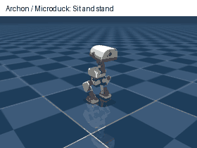

# M2g.4 — bounded composition and persistent Microduck sessions

Status: implemented and locally accepted for Microduck/MuJoCo composition, compatible policy handoff, persistent mock-model chat, reset, five pinned official motions and measured movement gates. Live cloud inference and genuine self-trained behavior require external inputs and remain unaccepted. Evidence: `docs/validation/m2g-4-microduck.json`.

## Execution contract

A data-only `SkillSequence` declares schema version 1, a total wall-time budget <=120 seconds and 1..16 ordered SkillCalls. All leaves are expanded, bound and validated before worker startup/motion. Registered `sequence.v1` Skills declare fixed steps in immutable binding config, no policy and no dynamic parameters. Nesting is bounded to four levels; cycles, unknown config and excessive expanded length/budgets are rejected.

The parent Executive holds whole-body resources across every child, including settling and policy handoff. Children share the parent execution authority without reacquiring resources. Each child retains its individual deadline; remaining parent time caps it. Failure/cancellation/deadline aborts later steps, explicitly stops the worker and preserves per-step measured evidence. Stop cleanup may extend a deadline by at most four seconds; a duration-complete result does not establish distance or velocity accuracy.

Compatible ONNX packages are preloaded at worker startup. A handoff requires idle, fault-free, measured upright and settled state, uses an existing verified session, and preserves physics/controller state and action history. It does not teleport/reset the robot. This adapter does not accept a sit/roll/jump policy merely because its tensor dimensions match.

## Interfaces

- `--run-skill-sequence skills/calls/microduck-sequence.json`: host-specified bounded task.
- `--run-skill skills/calls/microduck-patrol.json`: registered reusable composition.
- `--skill-instruction '前进两秒，向左转两秒，再前进两秒，最后停下'`: one model decision can choose a registered composition or the ordered `archon_sequence` planning tool. Parallel tool calls remain rejected.
- `--skill-chat`: repeated natural-language turns with one persistent worker; previous measured results provided as bounded context. `/stop` cancels; `/quit` ends the session. Faulted simulation requires explicit restart.

## Acceptance targets and external inputs

Test actual physics through CLI for repeated compositions, policy-ID handoffs, cancellation, parent deadlines, invalid late steps rejected before motion, custom composite tools and persistent mock-model turns. Preserve earlier package/keyboard regressions. Broaden nominal motion tests and report weak command behavior honestly.

Go2/second-platform execution validation is tracked under M2f.4/M2g.5; M2g.4 closes the Microduck/MuJoCo execution scope first.

A real cloud model requires API credentials inherited by the executing process. An export in another iTerm2 shell is not inherited by an already-running Codex process. A genuine custom-trained behavior requires a real checkpoint; hardware transfer requires a robot. These are external acceptance inputs, not implied completed tests. Different simulator and new official behavior adapters remain individually scoped integrations, with contract and behavior evidence required.

## Official motion adapter

Install optional weights outside Git:

```sh
.venv-microduck/bin/python scripts/install_microduck_behaviors.py
cargo build -p robo-archon-cli
cargo run -p robo-archon-cli -- --robot microduck --backend mujoco --list-skill-tools
cargo run -p robo-archon-cli -- --robot microduck --backend mujoco \
  --run-skill skills/calls/microduck-sitstand.json --viewer
```

`robots/microduck-behaviors.lock.json` pins five weights at the same official Hugging Face revision. SHA-256, exact tensor types/shapes, joint order/default pose, named observations, behavior-specific command metadata, action scale, finite inference and receipt are checked. User-installed packages cannot use the reserved `official.*` IDs. These behavior profiles are a local runtime overlay, keeping downloaded weights outside the body catalog and Git.

`microduck.behavior.v1` is a dedicated host adapter. Sitstand issues posture flag 1 for two simulated seconds, then flag 0 and verifies a return to standing. Ground-peck uses the upstream phase encoding. Left/right kick use the pinned manifest's 0.5-second policy window; roll uses its 1-second window. Each has an additional standing return interval. During sit/roll, only the trusted timed adapter allows expected low posture; roll permits expected inversion. Non-finite state remains fatal; a missing upright return latches a fault. All gates revert to ordinary locomotion on stop/expiry/abort. A cancelled sit/roll may report a fault if it cannot safely return standing. No ball/object is added and no object-task success is claimed.

`/reset` in chat is a host command, not an LLM tool: stop, reset physics/controller/history, assign a new episode ID, retain an explicit reset record. A physical push test confirms fall latch, refusal of further walking, explicit reset and a new successful walking interval. It is not a trained get-up motion.

## Reproduce acceptance

```sh
.venv-microduck/bin/python scripts/make_policy_fixture.py
cargo run -p robo-archon-cli -- --install-policy tmp-episodes/m2g3-fixture/policy
.venv-microduck/bin/python scripts/verify_microduck_composition.py
.venv-microduck/bin/python scripts/verify_microduck_behaviors.py
.venv-microduck/bin/python scripts/verify_microduck_fall.py
.venv-microduck/bin/python scripts/verify_policy_packages.py
.venv-microduck/bin/python scripts/verify_skill_agent.py
.venv-microduck/bin/python scripts/verify_microduck_keyboard.py
cargo test --workspace
```

Local HTTP mocks need loopback permission; macOS rendering needs CoreGraphics access. Neither requires a cloud key or GPU. `ROBO_ARCHON_MICRODUCK_INITIAL_YAW` is an optional diagnostic initial heading in radians (finite +/-pi); it is outside model-controlled Skill arguments. Rotated-start acceptance uses +/-0.8 radians on a flat floor.

For LIVE model acceptance, run this in the iTerm2 shell with your exported key:

```sh
.venv-microduck/bin/python scripts/verify_microduck_cloud.py
```

It uses `DEEPSEEK_API_KEY`/`OPENAI_API_KEY`, optional `LLM_BASE_URL`/`LLM_MODEL`, saves execution evidence locally, and fails if ordered motion, measured stop or model feedback is missing. Keys are not written to reports or command arguments. `--skill-chat --viewer` enables manual persistent chat with the same inherited credentials.



The preview is generated from actual rendered worker frames, not synthetic animation. Full frames remain in ignored local episode directories. No MP4 or ONNX weights are committed.
