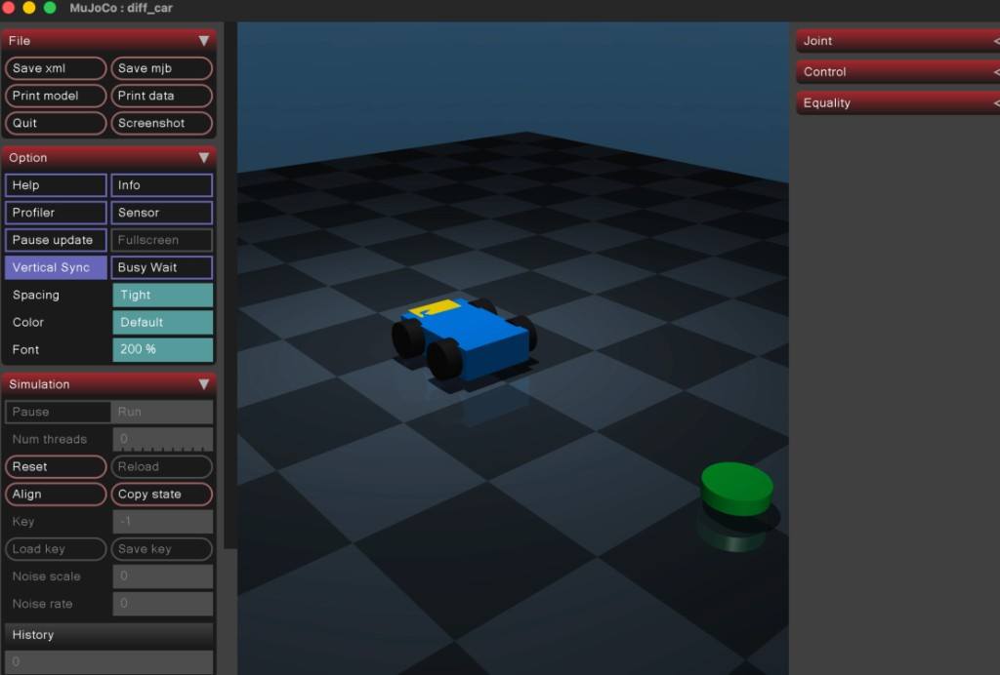

# 示例：语言驱动 MuJoCo 平面小车

用一句自然语言驱动内置 `diff_car` 模型：前进 → 左转 180°，并可打开交互窗口或导出 MP4。

本示例对应具身里程碑 **M2**（MuJoCo bridge + instruction / LLM 策略）。

---

## 你会看到什么

| 元素 | 含义 |
|------|------|
| 蓝色方块底盘 + 黑轮 | 平面小车（`root_x` / `root_y` / `root_yaw`） |
| 车头黄色小块 | 朝向标识（黄块一侧为前方） |
| 绿色圆柱 | 场景目标标记（本 demo 不强制到达） |
| 棋盘地面 | 便于肉眼判断位移与转角 |

### MuJoCo Viewer（开 `--viewer` 时）

窗口标题为 `MuJoCo : diff_car`。左侧是 File / Option / Simulation 面板，中间是 3D 视口，右侧可展开 Joint / Control。



**读图说明：**

1. **视口中央**：蓝车停在棋盘上；旁侧绿柱是 goal 标记。
2. **左侧 Simulation**：运行中时 `Run` 高亮；可 `Pause` / `Reset`。RoboArchon 驱动时不必手点这些按钮。
3. **左侧 Option**：可调字体大小、垂直同步等显示选项。
4. **右侧 Joint / Control**：可展开查看关节与执行器；语言策略下由 RoboArchon 写控制量。
5. **结束后**：默认会 **保持窗口**，方便你调视角或截图；关掉窗口后进程才退出。

录像不入库；需要成片时用下面的 `--record-video` 本地导出即可。

---

## 前置条件

1. **Rust / Cargo**（能编过本仓库）
2. **MuJoCo Python 环境**（推荐仓库内 venv）

```bash
# 若尚未创建
python3 -m venv .venv-mujoco
source .venv-mujoco/bin/activate
pip install -r python/requirements-mujoco.txt
```

3. **macOS 开窗口**：需 `mjpython`（一般随 `.venv-mujoco` 提供）。CLI 在 `--viewer` 时会自动选用。
4. **导出 MP4**（可选）：`brew install ffmpeg`

在仓库根目录执行后续命令，并建议设置：

```bash
export ROBO_ARCHON_PYTHON="$(pwd)/.venv-mujoco/bin/python"
```

---

## 一键跑通（推荐）

### A. 规则策略 + 交互窗口

不调用云端 LLM，短语表直接映射运动原语：

```bash
cargo run -p robo-archon-cli -- \
  --backend mujoco \
  --model builtin:diff_car \
  --policy instruction \
  --instruction "向前走一点再左转180度" \
  --viewer \
  --step-ms 0
```

期望结果：

1. 弹出与 **图 1** 类似的窗口；
2. 小车先沿朝向前进一段，再绕竖直轴转约 180°；
3. 动作结束后窗口仍打开，可拖拽视角观察；关闭窗口后 CLI 结束。

### B. 导出演示 MP4（适合发帖 / 存档）

```bash
mkdir -p tmp-episodes

cargo run -p robo-archon-cli -- \
  --backend mujoco \
  --model builtin:diff_car \
  --policy instruction \
  --instruction "向前走一点再左转180度" \
  --record-video ./tmp-episodes/car-demo.mp4 \
  --episode-dir ./tmp-episodes \
  --step-ms 0
```

成功时 stderr 会出现类似：

```text
[robo-archon] recording video → ./tmp-episodes/car-demo.mp4
...
[mujoco_worker] video saved: tmp-episodes/car-demo.mp4
```

也可只写 `--record-video`（不带路径），默认写到 episode 目录下的 `demo.mp4`。  
生成的 `.mp4` 默认被 gitignore，请勿提交。

### C. 多轮 TUI（推荐日常调试）

```bash
cargo run -p robo-archon-cli -- \
  --backend mujoco \
  --model builtin:diff_car \
  --policy instruction \
  --viewer --tui --step-ms 0
```

终端进入 Chat：连续输入指令（如「向前走一点」→「左转90度」），仿真会话不重启。`/quit` 退出。

### D. DeepSeek 等 LLM 策略（可选）

口语不一定要落在短语表里时：

```bash
export DEEPSEEK_API_KEY=sk-...

cargo run -p robo-archon-cli -- \
  --backend mujoco \
  --model builtin:diff_car \
  --policy llm \
  --instruction "往前开一点，然后掉头" \
  --viewer \
  --step-ms 0
```

LLM 只负责把自然语言编译成运动原语，仍经 Safety，不直连电机。

---

## 数据流（本示例）

```text
自然语言指令
    → InstructionPolicy / LlmPolicy（提案原语）
    → SafetyGate
    → Chronos（插值）
    → BridgedSimBackend（NDJSON）
    → mujoco_worker.py（物理步进 + 可选 viewer / 录像）
    → Episode 落盘（可选 media）
```

相关资产与代码：

| 路径 | 作用 |
|------|------|
| `python/models/diff_car.xml` | 小车 MJCF（含 `scene` / `chase` 相机） |
| `python/assets/catalog.json` | `builtin:diff_car` 解析 |
| `python/robo_archon_sim_workers/mujoco_worker.py` | MuJoCo worker |
| `crates/robo-archon-policy/` | `instruction` / `llm` 策略 |
| `crates/robo-archon-cli/` | CLI 入口 |

---

## 常用参数速查

| 参数 | 说明 |
|------|------|
| `--backend mujoco` | 走外部 MuJoCo worker |
| `--model builtin:diff_car` | 内置平面车（也可用本地 `.xml` 路径） |
| `--policy instruction` | 短语 → 原语（无需 API Key） |
| `--policy llm` | 云端 LLM → 原语 |
| `--instruction "..."` | 本轮自然语言指令 |
| `--viewer` | 打开交互窗口（见图 1） |
| `--record-video [PATH]` | 离屏帧 + ffmpeg 合成 MP4 |
| `--episode-dir DIR` | Episode 输出目录 |
| `--step-ms N` | 命令间墙钟延时；演示常用 `0` |

列出内置模型：

```bash
cargo run -p robo-archon-cli -- --list-models
```

---

## 排错

| 现象 | 处理 |
|------|------|
| macOS 开窗口失败 / Cocoa 报错 | 确认 `.venv-mujoco/bin/mjpython` 存在；设置 `ROBO_ARCHON_PYTHON` 指向该 venv |
| `video saved` 没有出现 | 安装 `ffmpeg`；确认 stderr 无 `offscreen render disabled` |
| 沙箱 / CI 无图形 | 不要开 `--viewer`；录像也需本机 GPU/显示服务，纯无头环境可能失败 |
| 动作太快看不清 | 加 `--viewer`，或适当增大 `--step-ms`（如 `20`） |

更完整的具身入门见 [`docs/embodied-getting-started.md`](../../docs/embodied-getting-started.md)。
